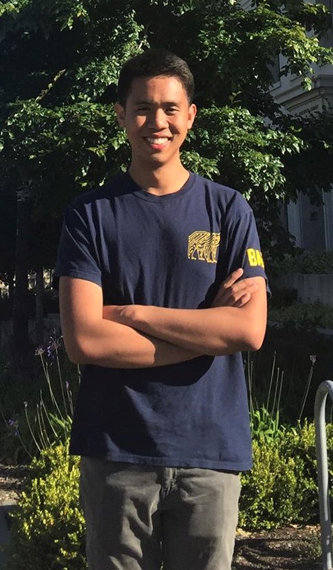

## About Me

  

    
  

  

    

      I am a fourth-year undergraduate student at the University of California, Berkeley, pursuing a degree in Electrical Engineering and Computer Sciences.
      I currently work in Prof. Sergey Levine's lab as an undergraduate researcher, working on model-based reinforcement learning together with my mentors Roberto Calandra and Rowan McAllister.
    

    

      Starting Fall 2019, I will be attending Princeton University as a PhD student in Computer Science.
    

    

      My interests include reinforcement learning, theoretical machine learning, as well as mathematics.
    

    

      This semester, I am a TA for EECS 126, an upper-division course on probability and random processes.
    

    

      You may reach me at kchua (at) berkeley (dot) edu.
    

  

## Publications

* [Deep Reinforcement Learning in a Handful of Trials using Probabilistic Dynamics Models](https://arxiv.org/abs/1805.12114).  
  [arXiv](https://arxiv.org/abs/1805.12114) | [website](https://sites.google.com/view/drl-in-a-handful-of-trials/home)  | [code](https://github.com/kchua/handful-of-trials)  
  **Kurtland Chua**, Roberto Calandra, Rowan McAllister, Sergey Levine.  
  *NeurIPS 2018 ([Spotlight presentation](https://youtu.be/6LuK72GCCnI?t=3483), ~4% of accepted papers).*  

## Talks

* "Deep Reinforcement Learning in a Handful of Trials using Probabilistic Dynamics Models." *Bay Area Machine Learning Symposium (Baylearn)*. October 2018.
  [video](https://www.youtube.com/watch?v=pq8xNCETPHU)

## Honors and Awards

* *National Science Foundation Graduate Research Fellowship (2019)*.
* *UC Berkeley EECS Honors Program (2019)*. Pursuing a concentration in Mathematics.
* *NVIDIA Pioneer Award (2018)*. Awarded for *Deep Reinforcement Learning in a Handful of Trials using Probabilistic Dynamics Models* at NeurIPS 2018.  
* *Phi Beta Kappa Honors Society (2018)*. Inducted as a junior.  
* *Dean's Honors List* for Fall '15, Spring '16, Fall '16, Spring '17, Spring '18, Fall '18.  
* *Quantedge Award for Academic Excellence (2018)*. Awarded to students of senior standing with a 4.0 GPA.  
* *Kraft Award for Freshmen (2015)*. Awarded to students who earn a 4.0 GPA during their first semester at UC Berkeley.  
